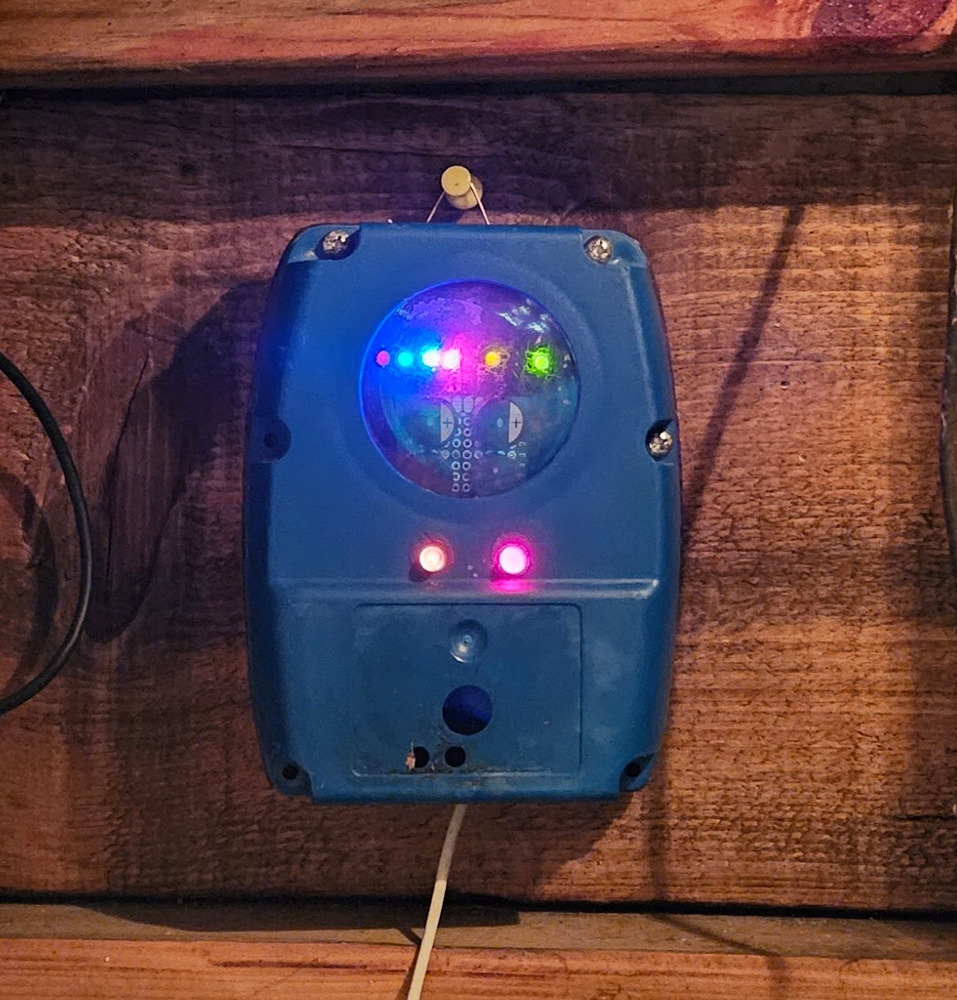
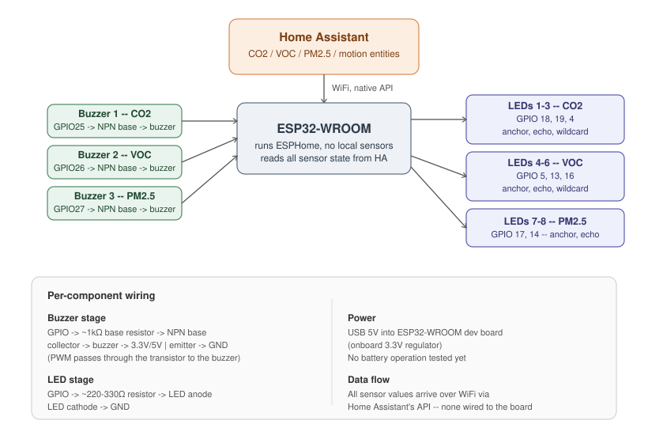

# Glitchy

*An ambient sound and light device that lets a room sing its own air quality.*

Glitchy is a small standalone device — an ESP32, three buzzers, eight
LEDs — that turns CO₂, VOC, particulate matter, and presence into sound
and light. It doesn't display numbers. It doesn't alarm. It sits in a
room and, quietly, tells you how that room is doing, in the same way you
can tell a fridge is running or a router is busy without reading a
single figure.

Built in the open as a FLOSSK project, an example of what creative, small-scale, unglamorous
open-source hardware can do when the goal is expression rather than
efficiency.



## What you need

This repo is firmware for the sensing/output device — it does **not**
include sensor wiring or a home automation setup. Before this is useful
to you, you need:

- An **ESP32** (WROOM, classic — see [Hardware](#hardware) below)
- A running **[Home Assistant](https://www.home-assistant.io)** instance
  on the same network
- **CO₂, VOC, PM2.5, and motion sensors already integrated into that
  Home Assistant instance**, exposed as entities — via any integration
  you like (another ESPHome device, a Zigbee/Z-Wave sensor, a
  manufacturer's official integration, etc.)

Glitchy pulls all sensor data from Home Assistant over its native API —
it does not read any air-quality sensor directly, and this repo doesn't
cover getting sensors into Home Assistant in the first place. If you
don't have that yet, get your sensors showing up as entities in Home
Assistant first, then come back here.

## Motivation

Air quality is invisible. A room can be quietly filling with CO₂ for
hours — the kind of slow staleness that makes a meeting drag or a
workspace feel subtly wrong — and the only way most people would know is
a number on a dashboard nobody is looking at. Air quality sensors exist
in plenty of homes and offices already; almost none of them are ever
*felt*. They're logged, graphed, and ignored.

This project started from a simple question: what if the room could just
tell you, the way a living space tells you things — through ambience,
through a change in mood, without demanding your attention or shouting
for it either. Not a dashboard. Not an alarm. Something closer to a pet,
or a very quiet appliance, that has its own way of being present.

It's also, deliberately, a piece of *open-source* creative technology —
built with parts anyone can buy, running entirely on open tools (ESPHome,
Home Assistant), documented openly, and meant to be forked, misread,
rewired, and improved. FLOSSK exists to show that open-source work can be
rigorous, useful, *and* strange or beautiful — this is a small
demonstration of that last part.

## Sonification: letting the room sing its own state

**Sonification** is the practice of representing data as sound instead of
as an image, a number, or a graph. It's an old idea with a very familiar
example: a Geiger counter doesn't show you a radiation reading, it
*clicks faster* — you understand the danger in your gut before you'd
have time to read a display. That immediacy, and the fact that sound
reaches you even when you're not looking, is exactly what this project
needed.

A screen requires attention. You have to look at it, at the right moment,
and interpret a number against a threshold you probably don't remember.
Sound and ambient light don't — they're peripheral by nature. You can be
across the room, half paying attention to something else, and still pick
up that something changed. That's the quality this project is built
around: information that lives in a space rather than sitting in an app,
felt rather than read. It's closer to how you already sense a room is
"stuffy" than to how you'd check a weather app.

Choosing sound (and light) over a display also meant choosing a
*character*, not just a channel — and that turned out to be most of the
actual design work.

**Each sensor got its own voice.** CO₂, VOC, and particulate matter each
drive one buzzer and one group of LEDs. The mapping is fixed and
consistent, so over time the room's "vocabulary" becomes legible without
ever needing a legend: if you hear the second buzzer, you know it's the
VOC sensor talking, the same way you'd recognize a particular ringtone as
a particular contact.

**Air quality bands became behaviors, not just volume.** Early versions
of this device just made things louder and faster as air quality
worsened — brighter LEDs, quicker blinks, more frequent buzzes. It read
as *busy*, not as *meaningful*. The current version instead gives each
air-quality band (calm, elevated, high) its own distinct character:

- **Calm** blinks and buzzes steadily and evenly — a room quietly ticking
  over, the way an idle machine still shows a heartbeat.
- **Elevated** gets restless — blinks arrive in short irregular bursts,
  buzzers tick a little more insistently.
- **High** genuinely *glitches* — stutters, dropouts, frequency jumps,
  occasional "stuck" flickers. The room doesn't just get louder, it
  starts to sound like something under strain.

That's the reasoning behind the glitch aesthetic specifically — and the
project's name: corrupted, irregular, imperfect sound is a more honest
metaphor for degraded air than a clean tone turned up louder would be.
Bad air isn't "more" of a good thing — it's a system starting to
misbehave, and the sound design tries to mirror that directly rather
than just scaling a dial.

**Even within one sensor's group, the LEDs aren't identical.** Each group
of LEDs has roles — an anchor that always shows the sensor's true current
state clearly, an echo that trails slightly behind it like a reflection,
and (for CO₂ and VOC) a wildcard that mostly follows along but
occasionally borrows a more agitated behavior at random. That
unpredictability is deliberate: a purely synchronized, deterministic
readout feels mechanical and eventually invisible — you stop noticing
something that's perfectly regular. A small amount of asymmetry and
randomness is what makes it read as *alive* rather than as an indicator
light with extra steps.

**And it had to earn the right to make noise.** A device that reacts to
every small fluctuation in sensor data becomes background noise you learn
to tune out — the opposite of the goal. So sound and light events are
throttled deliberately: air-quality *events* only fire on real
threshold crossings, not on every reading; the two most talkative
sensors (VOC and PM2.5) only make event-level sound while the room shows
recent motion, so an empty room stays quiet regardless of what the air is
doing; and a slow ambient layer keeps the piece from ever going fully
silent, at a level quiet enough to sit at the edge of attention rather
than in the middle of it.

Put together, the design goal was never "accurately display three sensor
readings." It was: give a room a way to have a mood, communicated the way
moods actually reach people — ambiently, asymmetrically, and only as
loudly as the moment deserves.

## How it works

**Sensors** (read from Home Assistant over the native API, not wired
directly to the ESP32):
- CO₂ — `sensor.pub_all_in_one_co2_pub`
- VOC — `sensor.esphome_web_811aa0_voc`
- PM2.5 — a particulate matter weight-concentration sensor
- Motion — a presence/motion binary sensor, used as an "awake" gate

**Sound** — three passive piezo buzzers, each wired through an NPN
transistor switching stage, each permanently assigned to one sensor:

| Buzzer | GPIO | Sensor |
|---|---|---|
| 1 | 25 | CO₂ |
| 2 | 26 | VOC |
| 3 | 27 | PM2.5 |

**Light** — eight single-color LEDs, direct GPIO, grouped by sensor:

| Group | GPIOs | Sensor | Roles |
|---|---|---|---|
| 1–3 | 18, 19, 4 | CO₂ | anchor, echo, wildcard |
| 4–6 | 5, 13, 16 | VOC | anchor, echo, wildcard |
| 7–8 | 17, 14 | PM2.5 | anchor, echo |

**Bands** — each sensor is tracked in three bands (calm / elevated /
high), which drive both the periodic ambient sound/light behavior and
the sharper glitch events fired on a band *crossing*:

| Sensor | Calm | Elevated | High |
|---|---|---|---|
| CO₂ | < 600 ppm | 600–1000 ppm | > 1000 ppm |
| VOC | < 150 | 150–400 | > 400 |
| PM2.5 | < 15 µg/m³ | 15–35 µg/m³ | > 35 µg/m³ |

(VOC and PM2.5 thresholds are starting points, tuned against common
air-quality breakpoints rather than measured against these specific
sensors — see [Limitations](#limitations--known-issues).)

**Motion gate** — motion sets the room "awake" for 7 minutes and resets
on renewed motion. CO₂'s ambient presence is never gated, since a room's
staleness is worth signaling whether or not anyone's in it right now; VOC
and PM2.5's more active event/glitch behavior only plays while the room
is awake.

Everything runs as a single [ESPHome](https://esphome.io) YAML
configuration, pulling sensor state from
[Home Assistant](https://www.home-assistant.io) over its native API —
no cloud dependency, no proprietary hub.

See the full system diagram below (buzzer/LED wiring, power, and where sensor data actually
comes from). 

## Hardware

Bill of materials, with the specific parts and values used in this
build:

| Part | Spec used here | Notes |
|---|---|---|
| Microcontroller | ESP32-WROOM (classic) dev board | No S3-specific features used — any classic ESP32-WROOM board should work |
| Buzzers | 3× passive piezo buzzer | Passive, not active — needs a driven PWM tone, doesn't self-oscillate |
| Transistors | 3× NPN, small-signal (e.g. 2N2222 or BC547) | One per buzzer, switching stage — see wiring diagram |
| Base resistor | ~1kΩ | One per transistor, GPIO → base |
| LEDs | 8× single-color, standard 5mm or similar | Direct GPIO drive, no driver chip |
| LED resistor | 220–330Ω | One per LED, current-limiting |
| Power | USB 5V into the ESP32-WROOM dev board | Onboard regulator provides 3.3V for the ESP32 itself |

**Power draw**: not currently measured/logged for this build. The ESP32
alone typically draws tens of mA at idle and up to ~200-300mA under WiFi
transmit bursts; the buzzers and LEDs add a modest amount on top when
active, but a bench measurement hasn't been done yet — see
[Limitations](#limitations--known-issues). USB power (a standard 5V/1A+
phone charger or a computer's USB port) has been sufficient in testing;
battery operation has not been tried.

## Repository layout

```
glitchy/
├── README.md                       — this file
├── LICENSE                         — MIT
├── .gitignore                      — keeps your real secrets.yaml out of git
├── firmware/
│   ├── glitchy.yaml                — the full ESPHome configuration
│   └── secrets.yaml.example        — placeholder credentials template
└── media/
    └── wiring-diagram.svg          — buzzer/LED wiring, power, and data flow
```

## Getting started

1. Make sure your [prerequisites](#what-you-need) are in place first —
   Home Assistant running, with CO₂/VOC/PM2.5/motion sensors already
   showing up as entities.
2. Install [ESPHome](https://esphome.io/guides/installing_esphome) (or
   use the Home Assistant ESPHome add-on).
3. Copy `firmware/secrets.yaml.example` to `firmware/secrets.yaml` and
   fill in your WiFi credentials and a generated API encryption key
   (command included as a comment in the file). `secrets.yaml` is
   gitignored — never commit your real one.
4. Update the `entity_id:` values in `firmware/glitchy.yaml` to match
   your own Home Assistant sensor entities.
5. Validate before flashing:
   ```
   esphome config firmware/glitchy.yaml
   ```
6. Flash over USB the first time:
   ```
   esphome run firmware/glitchy.yaml
   ```
   Subsequent updates can go over OTA once it's on your network.

## Limitations / known issues

Honest accounting of what's not yet solid, rather than presenting this
as a finished object:

- **VOC and PM2.5 thresholds are untuned.** The band edges in the table
  above are reasonable starting guesses based on common air-quality
  breakpoints, not measured against real data from these specific
  sensors in a real room. CO₂'s thresholds are more solid (set
  deliberately, not guessed) but still worth validating against your
  own space.
- **No fourth, melodic voice.** A small speaker and amplifier for a
  more musical/tonal layer (distinct from the three buzzers' glitch
  character) was part of the original design intent and hasn't been
  added yet.
- **Ambient-layer tuning is by feel, not measurement.** The blink
  timing, ambient sound frequency, and "wildcard" glitch probabilities
  were tuned by ear/eye during development, not against any formal
  metric — they're reasonable defaults, not validated optimal values.
- **Power draw hasn't been benchmarked.** See the note under
  [Hardware](#hardware) — no current-draw measurements have been taken,
  and only USB power has been tested.
- **Single ESP32, no redundancy.** If Home Assistant or the network is
  unreachable, sensor-driven behavior stops until connectivity returns
  (there's no local fallback/cached-state behavior).

## Project status

This is a first working version: standalone operation, three-band
sensor tracking, per-sensor buzzer identity, and a named-behavior /
per-LED-role blink engine for the LEDs. Open directions from here
include everything under [Limitations](#limitations--known-issues)
above, plus a physical enclosure (found-object metal, partially
exposing the electronics as the piece's "nervous system") once the
electronics themselves settle down further.

## Credits

Built by [sepse](https://github.com/sepse) for
[FLOSSK](https://flossk.org) — Free Libre Open Source Software Kosova.

## License

MIT — see [LICENSE](LICENSE).
